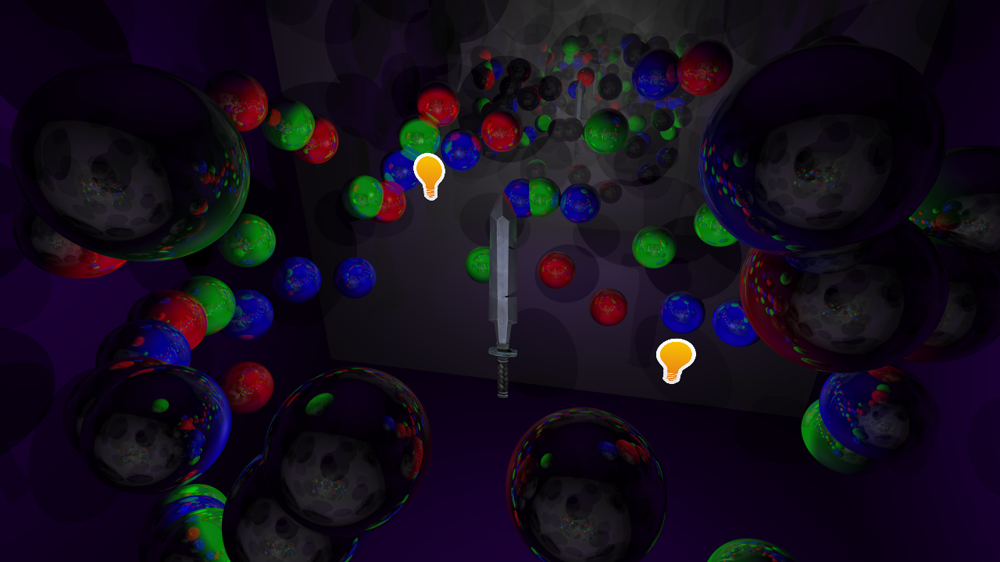
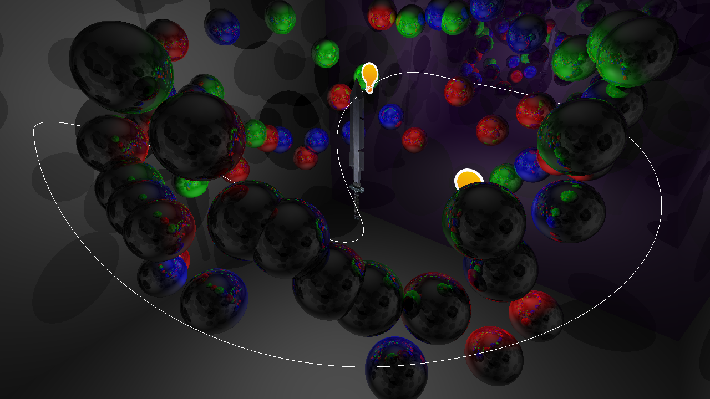
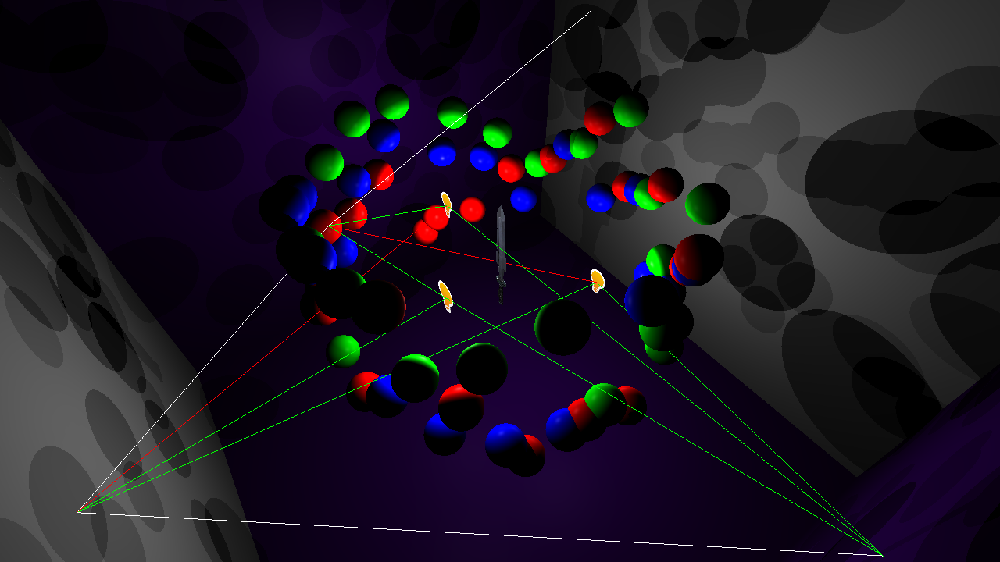

A raytracer written in C++ and DirectX compute shaders for a school project.

Supports meshes, triangles, and spheres. The texture channel of a mesh contains
a "reflectiveness" component which controls how reflective the surface is,
which can be seen at the edges of the sword in the screenshot below. Material
properties also govern how reflective the primitive types can be.

The number of lights, light bounces, and lighting parameters can be adjusted
using the in-game console which is powered by a custom GUI library.

Supports super sampling for anti aliasing.

# Screenshots
### Sample screenshot with anti aliasing

### Screenshot showing camera path for a benchmark
Visualized using a custom bezier-rendering shader

### Screenshot visualizing light bounces for a ray
Each bounce has a green line to the lights that illuminate it, and red lines to
the lights that do not illuminate it.

